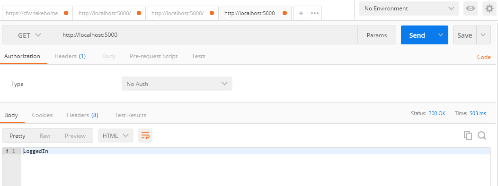
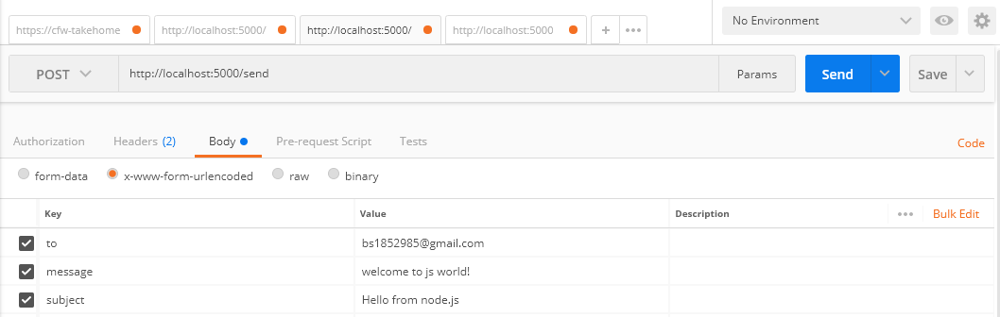
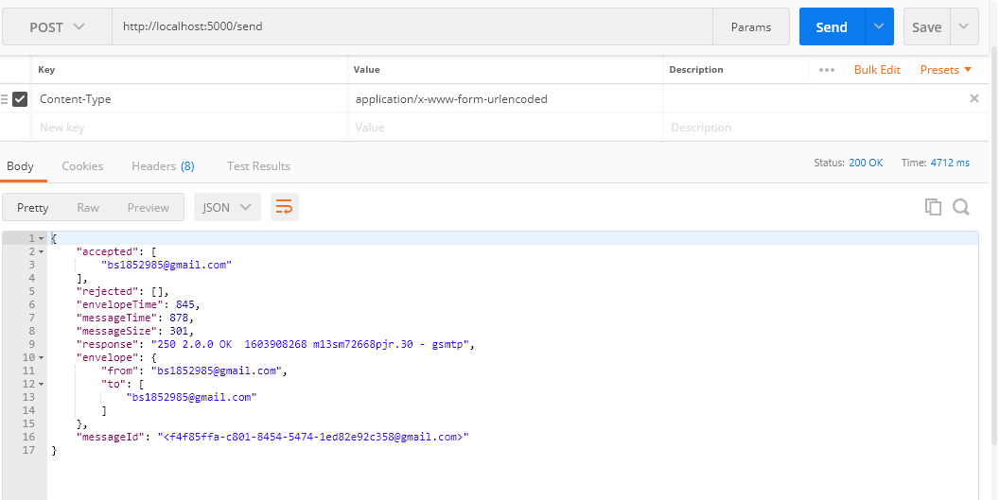

# GmailAPI-NodeJS-ExpressJS
Server API's for authorizing user and sending emails directly using API's.

# Requiremnt
- Latest version of Node and NPM.
- Postman for API testing.

# Installation
- Download and extract Zip file.
- Change directory to downloaded folder.
```
cd GmailAPI-NodeJS-ExpressJS-master
```
```
npm install
```
```
npm start
```
# Test API Endpoints
- Open Postman and send GET request.
```
API for Authorization

GET http://localhost:5000/
```
-  After succesfull authorization now its time to send email.
-  For that send POST request with body
```
API for Sending mail

Request Type: x-www-form-urlencoded
Request Body:
{
  to: Sender's Email ID,
  message: Message to be sent in body,
  subject: Email subject text
}

Post http://localhost:5000/send
```
# Screen Shots




